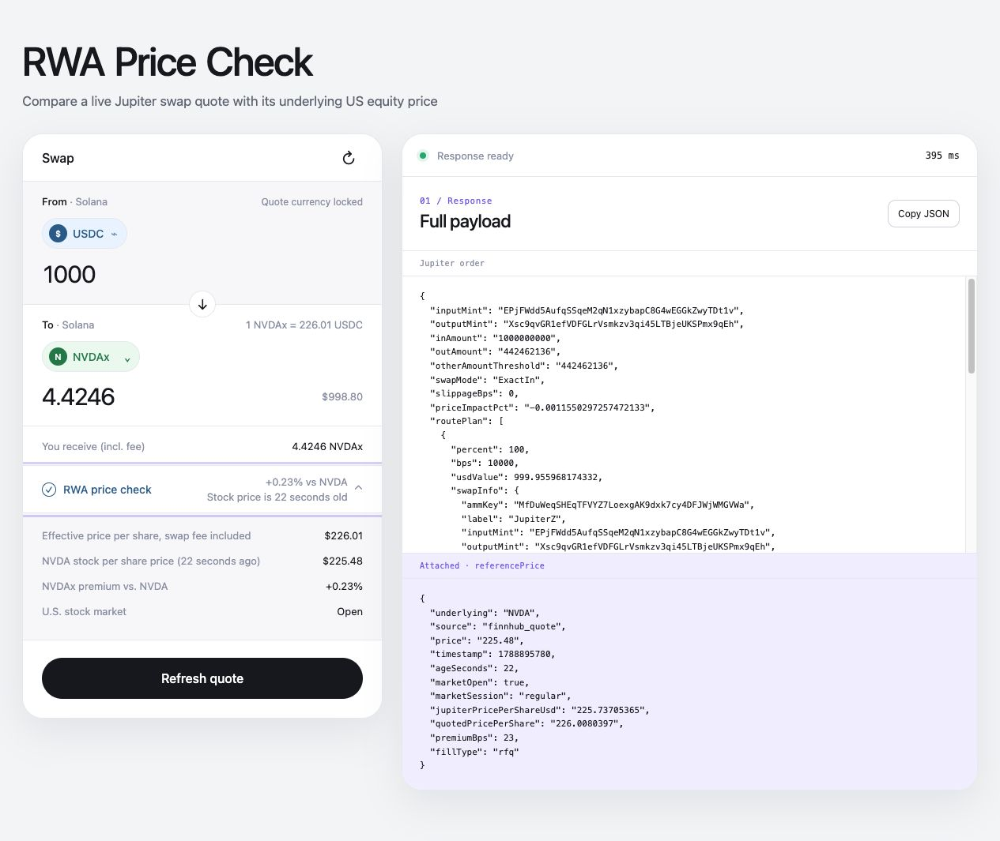

# RWA Price Check

Compare a live Jupiter xStock swap quote with the underlying U.S. equity price
before a wallet user confirms a trade. The API preserves Jupiter's response and
adds a timestamped Finnhub reference, its age, U.S. market context, and the
implied premium or discount.

[Live app](https://rwa-price-check.vercel.app) ·
[API implementation](app/api/order/route.ts) · [Test suite](tests/)

[](https://github.com/blakehendo/RWA-Price-Check/actions/workflows/ci.yml)

**Current evidence:** 83 deterministic tests · 15-case quote matrix · green CI



## User, job, and flow

**User:** A PM or engineer integrating tokenized-stock swaps into a wallet or
brokerage-style application.

**Job:** Give users enough price context to judge an xStock quote before they
confirm it.

**Flow:** Select an xStock and USDC amount, request a quote, then compare the
fee-inclusive swap price with the timestamped underlying stock price.

## Try it in 30 seconds

1. Open the [live app](https://rwa-price-check.vercel.app).
2. Choose TSLAx, NVDAx, AAPLx, SPYx, or GOOGLx and enter **$10–$100,000 USDC**.
3. Select **Get quote**.
4. Open **RWA price check** to see the effective price, stock reference and age,
   premium or discount, and U.S. market status.

The prototype requests quote data only. It does not connect a wallet, provide a
taker address, construct a transaction, sign anything, or submit a trade
onchain.

## API

```bash
curl "https://rwa-price-check.vercel.app/api/order?ticker=NVDA&amountUsdc=1000"
```

The response preserves Jupiter's order fields and attaches the final 11-field
`referencePrice` contract:

```json
{
  "inputMint": "EPjFWdd5AufqSSqeM2qN1xzybapC8G4wEGGkZwyTDt1v",
  "outputMint": "Xsc9qvGR1efVDFGLrVsmkzv3qi45LTBjeUKSPmx9qEh",
  "inAmount": "1000000000",
  "outAmount": "433923746",
  "swapType": "rfq",
  "router": "jupiterz",
  "referencePrice": {
    "underlying": "NVDA",
    "source": "finnhub_quote",
    "price": "230.36",
    "timestamp": 1788552000,
    "ageSeconds": 12011,
    "marketOpen": false,
    "marketSession": "post-market",
    "jupiterPricePerShareUsd": "230.10",
    "quotedPricePerShare": "230.46",
    "premiumBps": 4,
    "fillType": "rfq"
  }
}
```

## Architecture and tradeoffs

The browser calls one server-side `/api/order` route. That route requests a
Jupiter order, a Finnhub stock price, and Finnhub's U.S. market status in
parallel under a 2.5-second request budget. Jupiter is required for a useful
response; either Finnhub request can fail without hiding a valid swap quote.
The Finnhub key remains on the server and is never sent to the browser.

Short in-memory caches reduce duplicate calls: 10 seconds for an identical
Jupiter quote, 5 seconds for a stock reference, and 60 seconds for market status.
There is no database or persisted quote history. Serverless instances do not
share these caches.

The main limitations are intentional prototype cuts. The app supports one
USDC-to-xStock direction and five Solana xStocks. It does not provide a taker,
transaction, wallet connection, signature, or trade execution. Finnhub may
return the last regular close outside market hours, so the UI always shows the
reference price's age rather than implying that it is live.

## Local development

```bash
npm ci
cp .env.example .env.local
# Add FINNHUB_KEY to .env.local
npm run dev
```

## Verification

```bash
# Deterministic fixture-backed suite: 83 tests
npm test

# Production compilation and TypeScript validation
npm run build

# Manually triggered live Jupiter and Finnhub provider checks
FINNHUB_KEY=your_key npm run test:live
```

The default suite never depends on network availability. Its 15-case matrix uses
recorded Jupiter responses and controlled Finnhub inputs. The 17-test live suite
calls Jupiter for all five tickers at $100, $1,000, and $10,000, plus one Finnhub
stock-quote contract and one U.S. market-status contract; it is not a 15-case
live end-to-end Finnhub matrix.
